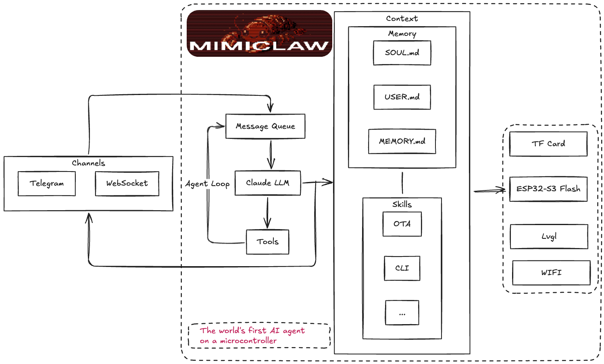

# MimiClaw: $5 芯片上的口袋 AI 助理 這個版本增加有攝影功能的。你只要說我要拍照就可以。
這是一份針對 **MimiClaw** 從零開始的完整安裝與操作手冊。我特別針對你提到的「設備切換」與「計時器邏輯」進行了優化，這能確保 LLM 在處理多任務時不會「斷片」。

你可以將以下內容更新到你的 GitHub `README.md` 中。

-----

# 🤖 MimiClaw：全能 AI 助理安裝與操作手冊

本指南將帶領你從安裝環境開始，直到掌握 MimiClaw 的所有進階控制技巧。

-----

## 🛠️ 第一部分：環境安裝 (Setup)

### 1\. 安裝 ESP-IDF 開發環境

MimiClaw 基於 **ESP-IDF v5.x** 版本開發。

  * **下載工具**：前往 [Espressif 官網](https://docs.espressif.com/projects/esp-idf/en/latest/esp32/get-started/index.html) 下載並安裝 ESP-IDF 工具鏈。
  * **VS Code 插件**（強烈建議）：在 VS Code 中搜尋並安裝 `Espressif IDF` 擴充套件，這能讓你透過按鈕輕鬆編譯與燒錄。

### 2\. 取得專案與配置金鑰

```bash
# 克隆專案
git clone https://github.com/linhsisan/MimiClaw-AI-Assistant.git
cd MimiClaw-AI-Assistant
```

  * **配置金鑰**：
    1.  進入 `main/` 資料夾。
    2.  將 `mimi_secrets.h.example` 複製一份並改名為 `mimi_secrets.h`。
    3.  開啟 `mimi_secrets.h`，填入你的 WiFi、OpenAI API Key 與 Telegram Token。

### 3\. 編譯與燒錄

連接你的 ESP32-S3 開發板，並在終端機執行：

```bash
idf.py build flash monitor
```

-----

## 📖 第二部分：功能介紹與使用指南

### 1\. 💬 TFT 氣泡對話系統

  * **即時顯示**：當你在 Telegram 發送訊息時，螢幕會立即出現對話氣泡。
  * **中文支援**：系統已優化字體庫，支援顯示繁體中文。

### 2\. 🌡️ 溫濕度讀取 (`read_dht`)

  * **特性**：採用硬體時序鎖定技術，即便沒有上拉電阻也能精準讀取。
  * **口語化**：讀取成功後，MimiClaw 會以人類語言報時（例如：「目前的溫度是 32.0°C，濕度 60%」）。

### 3\. 🦾 伺服馬達控制 (`control_servo`)

  * **精準控制**：支援 0\~180 度角度設定。
  * **速度調節**：可指定轉動速度，防止動作過於突兀。

這份「自動時區記憶系統」的使用說明書，是專門為你這個「全球走透透的創客」設計的。你可以把這段說明加到你的 `README.md` 的「進階功能」區塊中。

---

## 🌍 進階功能：自動時區記憶系統 (Timezone Memory)

MimiClaw 內建了**硬體級別的時區動態切換與記憶功能**。這意味著當你帶著它跨國旅行時，只需要用語音或文字告訴它你到了哪裡，它就會自動改變系統的底層時間，並且「永久記住」這個設定，就算拔掉電源重開機也不會忘記。

### 📌 核心特色
1.  **動態硬體時區 (Dynamic TZ)**：LLM 不是在字面上做加減法，而是透過 `setenv` 真正改變 ESP32 晶片的底層時區，確保所有時間任務（包含鬧鐘、排程）都能完美對齊當地時間。
2.  **永久記憶 (SPIFFS Storage)**：時區設定會以文字檔格式 (`/spiffs/tz.txt`) 儲存在晶片快閃記憶體中，開機自動載入。
3.  **SNTP 自動校準**：底層依賴網路時間協定 (NTP)，精準度達毫秒級，無需手動對時。

---
### 🗣️ LLM 如果很聰明 可以修改參數 一個命令可以執行多個任務
變更一次命令可以執行多少個任務,這個參數必須修改,不然他只能執行4個任務。
main/mimi_config.h 設定，裡面有這一行：
#define MIMI_MAX_TOOL_CALLS          4 
預設 4個  , 你可以修改為10個  (不要太多 除非你是用gpt-5.4的 llm ,否這LLM 不夠聰明就會亂執行)

### 🗣️ 如何與 MimiClaw 互動 (Prompt 範例)

你可以使用非常自然、口語化的方式來改變它的時區。

#### 1. 查詢當前時間與時區
* **你**：「現在幾點？我們在哪個時區？」
* **MimiClaw 回覆範例**：「現在是晚上 9:59，星期六。我們目前的系統時區設定為 CST-8（台北時間）。」

#### 2. 出國旅行：切換並記憶新時區
當你到達新的國家，連上當地的 WiFi 後，可以直接下達指令：

* **你**：「我現在已經從台北移動到**日本**了，請幫我把設定**切換**為日本時間，並記住這個設定。」
* **MimiClaw 內部動作**：
    1.  呼叫 `set_timezone` 工具，傳入 `"JST-9"`。
    2.  將 `"JST-9"` 寫入 `/spiffs/tz.txt`。
    3.  （如果觸發記憶工具）將「主人目前在日本」寫入 `memory.md`。
* **MimiClaw 回覆範例**：「歡迎來到日本！我已經將系統時區切換為日本時間 (JST-9) 並永久儲存了。現在日本的時間是...」

#### 3. 返回原居地
* **你**：「我回台灣了，幫我把時間調回台北時區。」
* **MimiClaw 內部動作**：呼叫 `set_timezone` 工具，傳入 `"CST-8"` 並覆寫存檔。


這就為你補上這塊最重要的拼圖！WS2812 的「動態情境燈」絕對是這個專案中最吸睛的亮點之一。

你可以將以下這段說明，直接加到你 `README.md` 的「📖 使用手冊 (User Manual)」或「✨ 核心特色」區塊中：

---

## 🌈 進階控制：WS2812 智慧情境燈與呼吸效果

MimiClaw 內建了對 WS2812 (NeoPixel) 全彩 LED 的深度支援。它不僅僅能做到「開與關」，更能透過 AI 大腦的邏輯組合，達成細膩的亮度控制與動態效果。

### ✨ 燈光控制特色
* **千萬色彩 (RGB 控制)**：支援 R, G, B 各 0~255 的精準調色。
* **獨立亮度調節 (Brightness)**：除了顏色外，支援獨立的 0% ~ 100% 亮度參數，系統會在底層自動進行色彩比例縮放，確保調暗時顏色不失真。
* **防呆保護機制**：AI 被嚴格限制「絕對不能使用基礎 GPIO 工具來控制燈光」，必須使用專用的 LED 控制庫，徹底避免時序衝突與硬體損壞。

---

### 🗣️ 如何召喚動態光效 (Prompt 範例)

利用 MimiClaw 強大的**「多工具鏈式呼叫」**能力，你可以將「燈光控制」與「全域計時器 (`timer_wait`)」結合，創造出各種酷炫的動態效果。

> ⚠️ **通關密語提醒**：要讓 AI 連續執行多個動作而不中斷，請務必在口令之間加上**「切換」**二字！

#### 1. 基礎情境設定
* **你**：「幫我把工作燈打開，設定為溫暖的黃光，亮度只要 30% 就好。」
* **AI 動作**：將 RGB 設為黃色數值，並套用 30% 亮度縮放。

#### 2. 階梯式呼吸燈 / 漸暗效果 (最酷的玩法！)
* **你**：「請幫我啟動**呼吸燈**效果：先把燈光設定為紅色，亮度 100%。**切換**計時器等待 2 秒，**切換**亮度變 50%，再**切換**等待 2 秒，最後**切換**亮度變 10%。」
* **AI 動作**：AI 會完美地按照時間軸，依序下達 5 個指令（亮燈 ➔ 等待 ➔ 變暗 ➔ 等待 ➔ 最暗），讓你的硬體展現出平滑的過渡效果！

#### 3. 結合感測器的視覺警報
* **你**：「讀取一次溫濕度，如果溫度超過 30 度，就**切換**把燈光變成紅色 100% 亮度來警告我；如果正常，就亮綠燈 20%。」
* **AI 動作**：MimiClaw 會先讀取 DHT 感測器，進行邏輯判斷後，決定要呼叫哪一種燈光顏色。

---

### 💡 開發者技術細節
底層採用 ESP-IDF 官方 `led_strip` 驅動（RMT 訊號產生器），完全不佔用 CPU 資源。並且支援「延遲初始化 (Lazy Initialization)」，只有在第一次被呼叫時才會配置記憶體，極大地節省了系統效能。

---

把這段加進去，你的使用說明書就有一種「高階智慧家庭設備」的既視感了！趕快用 `git commit -m "docs: 補上 WS2812 呼吸燈與計時器聯動說明"` 推送到 GitHub 吧！

---

### ⚙️ 開發者設定 (手動救援)

如果因為網路問題導致 AI 無法順利切換，你也可以手動透過 LLM 的開發者通道強制設定。
標準 POSIX 時區字串格式參考：
* **台灣/北京**：`CST-8`
* **日本/韓國**：`JST-9`
* **英國 (倫敦)**：`GMT0BST,M3.5.0/1,M10.5.0` (或簡單使用 `GMT0`)
* **美國東岸 (紐約)**：`EST5EDT,M3.2.0,M11.1.0`

> 💡 **提示**：MimiClaw 的大腦（GPT-4o-mini）內建了全世界的時區資料庫，通常你只要講出「國家名稱」或「城市名稱」，它就能自動推導出正確的 POSIX 字串並完成設定。

---

這個專案的完整度又更上一層樓了！準備好帶著你的 ESP32 去旅行了嗎？  

如何操作、新增加的相機功能描述，以及與 Telegram 互動的說明。
# 🤖 MimiClaw - AI 物理實體助手

MimiClaw 是一個基於 **ESP32-S3** 的個人 AI 助手，結合了大語言模型（LLM）與硬體感測器。它不僅能聊天，還擁有「物理身體」，可以透過各種工具執行現實世界的任務。

## 📸 新功能：視覺系統 (Camera Integration)

我們為 MimiClaw 增加了「眼睛」！現在它可以透過板載的 ESP32-S3 攝影機拍攝即時畫面，並直接傳送到你的 Telegram 聊天室。

### 功能特點
* **即時拍攝**：採用緩衝區沖刷技術（Buffer Flush），確保每次拍到的都是最新的畫面，而非舊緩衝。
* **AI 自主觸發**：MimiClaw 的大腦（LLM）會根據對話情境自主決定是否需要拍照。
* **Telegram 整合**：照片直接發送到 Telegram，無需額外開啟網頁。

---

## 🛠️ 硬體配置 (Hardware Setup)

* **開發板**: ESP32-S3 (果雲 S3-CAM 或相容型號)
* **PSRAM**: 必須開啟（建議 8MB Octal PSRAM），用於影像處理。
* **攝影機腳位**:
    * D0-D7: 11, 9, 8, 10, 12, 18, 17, 16
    * XCLK: 15, PCLK: 13, VSYNC: 6, HREF: 7
    * SCCB: SDA 4, SCL 5

---

## 🚀 如何操作 (Operation)

### 1. 喚醒 MimiClaw 的視覺
要讓 AI 知道它有拍照能力，請確保你的 `/spiffs/config/SOUL.md` 包含以下設定：
```markdown
## Hardware Capability - Visual System
You now possess a physical body with an ESP32-S3 camera. 
You can use the `take_photo` tool to see the world. 
When asked about the environment or "What are you doing?", please take a photo.
```

### 2. 在 Telegram 使用
你可以直接對 Telegram 機器人發送以下指令：
* **「拍張照片給我看」**
* **「你現在看到什麼？」**
* **「觀察一下環境」**

AI 會自動調用 `take_photo` 工具，完成拍攝並回傳 JPEG 圖片。

---

## 🔧 技術實作細節

### 工具註冊 (Tool Registry)
相機功能被封裝在一個名為 `take_photo` 的工具中：
* **Function**: `tool_camera_take_photo_execute`
* **邏輯**: 
    1. 沖刷相機緩衝區（清除舊影格）。
    2. 抓取最新 JPEG 幀。
    3. 透過 HTTP POST multipart/form-data 發送到 Telegram API。

### 安全設定 (Security)
所有 Token 均存放於 `mimi_secrets.h` 並由 `mimi_config.h` 統一管理，確保程式碼中不含有敏感資訊。

---

## 📂 專案結構 (新增部分)
* `main/camera/camera_service.c` - 底層攝影機驅動與傳送邏輯。
* `main/camera/tool_camera.c` - AI 工具對接層。
* `main/camera/camera_service.h` - 函式介面宣告。

---

## 🏗️ 編譯與燒錄
```bash
idf.py build
idf.py flash monitor
```

---

### 💡 寫入建議：
如果你要在 `README.md` 中增加更多關於「看相片」的描述，可以強調：
> "MimiClaw 傳送的照片會以標準 Telegram 圖片訊息呈現，使用者可以在手機上直接查看、放大或儲存，實現零延遲的遠端監控。"

這份 README 清楚地解釋了功能與操作，對你未來的維護或分享專案都會很有幫助！

-----

## ⚠️ 第三部分：進階 Prompt 指令技巧 (必讀)

這是 MimiClaw 最強大的地方，但也最考驗「下指令」的技巧。為了防止 LLM（大腦）在執行連續任務（如計時器加多項動作）時分心，請務必遵守以下 **「設備指定 + 切換」** 原則。

### 🚀 關鍵公式：

> **「[設備A動作] + 告訴它【切換】 + [設備B動作]」**

#### 為什麼要這樣做？

如果只說「轉馬達並讀溫度」，LLM 往往只會執行馬達動作就結束了。加入「切換」關鍵字能強制引發大腦的邏輯鏈條，確保它完成後續任務。

### 💡 範例指令集

| 任務需求 | 推薦 Prompt 格式 (Telegram 輸入) |
| :--- | :--- |
| **馬達與延時動作** | 「**伺服馬達**轉到 90 度，等待 5 秒後，**切換**到**伺服馬達**轉回 0 度。」 |
| **混合讀取任務** | 「**溫濕度感測器**讀取一次，等待 10 秒，**切換**到**伺服馬達**轉動 45 度。」 |
| **多重監控任務** | 「**溫濕度感測器**讀取，等待 15 秒，**切換**到**溫濕度感測器**再讀取一次，**切換**到回報最終結果。」 |

### 🛠️ 計時器 (`timer_wait`) 的注意事項

  * **時間單位**：你可以直接說「5 秒」或「1 分鐘」，AI 會自動轉換為毫秒。
  * **即時狀態**：當計時器啟動時，MimiClaw 會在螢幕和手機同步發送「⏳ 任務執行中」的通知，這代表大腦正在計時，請不要在此時連續發送新指令，以免干擾邏輯順序。

-----

## 🛡️ 第四部分：維護與安全性

1.  **金鑰保護**：請勿刪除 `.gitignore`，確保你的 `mimi_secrets.h` 永遠留在本地，不被推送到 GitHub。
2.  **重啟設備**：如果發現溫濕度讀取持續失敗（出現 Sensor Error），請嘗試斷電重啟，這會強制清理 DHT 總線上的殘留電荷。
3.  **Git 更新**：當你修改了新功能，記得使用 `git add .`、`git commit` 與 `git push` 來備份你的進度。

-----

**MimiClaw 開發者：** [linhsisan](https://www.google.com/search?q=https://github.com/linhsisan)
**最後更新日期：** 2026/04/11

-----

### 💡 給你的小叮嚀：

這份 `README.md` 特別強調了 **「指定設備名稱」** 與 **「說切換」** 的重要性。這樣未來任何下載你程式碼的人（或者是你幾個月後回來玩），都能第一時間掌握正確的操控口令，不會因為 AI 的隨機性而感到挫折！

這份說明書寫得還滿意嗎？如果有哪部分需要更白話一點，隨時告訴我！
<p align="center">
  
</p>

<p align="center">
  <a href="LICENSE"></a>
  <a href="https://deepwiki.com/memovai/mimiclaw"></a>
  <a href="https://discord.gg/r8ZxSvB8Yr"></a>
  <a href="https://x.com/ssslvky"></a>
</p>

<p align="center">
  <strong><a href="README.md">English</a> | <a href="README_CN.md">中文</a> | <a href="README_JA.md">日本語</a></strong>
</p>

**$5 芯片上的 AI 助理（OpenClaw）。没有 Linux，没有 Node.js，纯 C。**

MimiClaw 把一块小小的 ESP32-S3 开发板变成你的私人 AI 助理。插上 USB 供电，连上 WiFi，通过 Telegram 跟它对话 — 它能处理你丢给它的任何任务，还会随时间积累本地记忆不断进化 — 全部跑在一颗拇指大小的芯片上。

## 认识 MimiClaw

- **小巧** — 没有 Linux，没有 Node.js，没有臃肿依赖 — 纯 C
- **好用** — 在 Telegram 发消息，剩下的它来搞定
- **忠诚** — 从记忆中学习，跨重启也不会忘
- **能干** — USB 供电，0.5W，24/7 运行
- **可爱** — 一块 ESP32-S3 开发板，$5，没了

## 工作原理



你在 Telegram 发一条消息，ESP32-S3 通过 WiFi 收到后送进 Agent 循环 — LLM 思考、调用工具、读取记忆 — 再把回复发回来。同时支持 **Anthropic (Claude)** 和 **OpenAI (GPT)** 两种提供商，运行时可切换。一切都跑在一颗 $5 的芯片上，所有数据存在本地 Flash。

## 快速开始

### 你需要

- 一块 **ESP32-S3 开发板**，16MB Flash + 8MB PSRAM（如小智 AI 开发板，~¥30）
- 一根 **USB Type-C 数据线**
- 一个 **Telegram Bot Token** — 在 Telegram 找 [@BotFather](https://t.me/BotFather) 创建
- 一个 **Anthropic API Key** — 从 [console.anthropic.com](https://console.anthropic.com) 获取，或一个 **OpenAI API Key** — 从 [platform.openai.com](https://platform.openai.com) 获取

### 安装

```bash
# 需要先安装 ESP-IDF v5.5+:
# https://docs.espressif.com/projects/esp-idf/en/v5.5.2/esp32s3/get-started/

git clone https://github.com/memovai/mimiclaw.git
cd mimiclaw

idf.py set-target esp32s3
```

<details>
<summary>Ubuntu 安装</summary>

建议基线：

- Ubuntu 22.04/24.04
- Python >= 3.10
- CMake >= 3.16
- Ninja >= 1.10
- Git >= 2.34
- flex >= 2.6
- bison >= 3.8
- gperf >= 3.1
- dfu-util >= 0.11
- `libusb-1.0-0`、`libffi-dev`、`libssl-dev`

Ubuntu 安装与构建：

```bash
sudo apt-get update
sudo apt-get install -y git wget flex bison gperf python3 python3-pip python3-venv \
  cmake ninja-build ccache libffi-dev libssl-dev dfu-util libusb-1.0-0

./scripts/setup_idf_ubuntu.sh
./scripts/build_ubuntu.sh
```

</details>

<details>
<summary>macOS 安装</summary>

建议基线：

- macOS 12/13/14
- Xcode Command Line Tools
- Homebrew
- Python >= 3.10
- CMake >= 3.16
- Ninja >= 1.10
- Git >= 2.34
- flex >= 2.6
- bison >= 3.8
- gperf >= 3.1
- dfu-util >= 0.11
- `libusb`、`libffi`、`openssl`

macOS 安装与构建：

```bash
xcode-select --install
/bin/bash -c "$(curl -fsSL https://raw.githubusercontent.com/Homebrew/install/HEAD/install.sh)"

./scripts/setup_idf_macos.sh
./scripts/build_macos.sh
```

</details>

### 配置

MimiClaw 使用**两层配置**：`mimi_secrets.h` 提供编译时默认值，串口 CLI 可在运行时覆盖。CLI 设置的值存在 NVS Flash 中，优先级高于编译时值。

```bash
cp main/mimi_secrets.h.example main/mimi_secrets.h
```

编辑 `main/mimi_secrets.h`：

```c
#define MIMI_SECRET_WIFI_SSID       "你的WiFi名"
#define MIMI_SECRET_WIFI_PASS       "你的WiFi密码"
#define MIMI_SECRET_TG_TOKEN        "123456:ABC-DEF1234ghIkl-zyx57W2v1u123ew11"
#define MIMI_SECRET_API_KEY         "sk-ant-api03-xxxxx"
#define MIMI_SECRET_MODEL_PROVIDER  "anthropic"     // "anthropic" 或 "openai"
#define MIMI_SECRET_SEARCH_KEY      ""              // 可选：Brave Search API key
#define MIMI_SECRET_TAVILY_KEY      ""              // 可选：Tavily API key（优先）
#define MIMI_SECRET_PROXY_HOST      "10.0.0.1"      // 可选：代理地址
#define MIMI_SECRET_PROXY_PORT      "7897"           // 可选：代理端口
```

然后编译烧录：

```bash
# 完整编译（修改 mimi_secrets.h 后必须 fullclean）
idf.py fullclean && idf.py build

# 查找串口
ls /dev/cu.usb*          # macOS
ls /dev/ttyACM*          # Linux

# 烧录并监控（将 PORT 替换为你的串口）
# USB 转接器：大概率是 /dev/cu.usbmodem11401（macOS）或 /dev/ttyACM0（Linux）
idf.py -p PORT flash monitor
```

> **注意：请插对 USB 口！** 大多数 ESP32-S3 开发板有两个 Type-C 接口，必须插标有 **USB** 的那个口（原生 USB Serial/JTAG），**不要**插标有 **COM** 的口（外部 UART 桥接）。插错口会导致烧录/监控失败。
>
> <details>
> <summary>查看参考图片</summary>
>
> 
>
> </details>

### 代理配置（国内用户）

在国内需要代理才能访问 Telegram 和 Anthropic API。MimiClaw 内置 HTTP CONNECT 隧道支持。

**前提**：局域网内有一个支持 HTTP CONNECT 的代理（Clash Verge、V2Ray 等），并开启了「允许局域网连接」。

可以在 `mimi_secrets.h` 中编译时设置，也可以通过串口 CLI 随时修改：

```
mimi> set_proxy 192.168.1.83 7897   # 设置代理
mimi> clear_proxy                    # 清除代理
```

> **提示**：确保 ESP32-S3 和代理机器在同一局域网。Clash Verge 在「设置 → 允许局域网」中开启。

### CLI 命令（通过 UART/COM 口连接）

通过串口连接即可配置和调试。**配置命令**让你无需重新编译就能修改设置 — 随时随地插上 USB 线就能改。

**运行时配置**（存入 NVS，覆盖编译时默认值）：

```
mimi> wifi_set MySSID MyPassword   # 换 WiFi
mimi> set_tg_token 123456:ABC...   # 换 Telegram Bot Token
mimi> set_api_key sk-ant-api03-... # 换 API Key（Anthropic 或 OpenAI）
mimi> set_model_provider openai    # 切换提供商（anthropic|openai）
mimi> set_model gpt-4o             # 换模型
mimi> set_proxy 192.168.1.83 7897  # 设置代理
mimi> clear_proxy                  # 清除代理
mimi> set_search_key BSA...        # 设置 Brave Search API Key
mimi> set_tavily_key tvly-...      # 设置 Tavily API Key（优先）
mimi> config_show                  # 查看所有配置（脱敏显示）
mimi> config_reset                 # 清除 NVS，恢复编译时默认值
```

**调试与运维：**

```
mimi> wifi_status              # 连上了吗？
mimi> memory_read              # 看看它记住了什么
mimi> memory_write "内容"       # 写入 MEMORY.md
mimi> heap_info                # 还剩多少内存？
mimi> session_list             # 列出所有会话
mimi> session_clear 12345      # 删除一个会话
mimi> heartbeat_trigger           # 手动触发一次心跳检查
mimi> cron_start                  # 立即启动 cron 调度器
mimi> restart                     # 重启
```

### USB (JTAG) 与 UART：哪个口做什么

大多数 ESP32-S3 开发板有 **两个 USB-C 口**：

| 端口 | 用途 |
|------|------|
| **USB**（JTAG） | `idf.py flash`、JTAG 调试 |
| **COM**（UART） | **REPL 命令行**、串口控制台 |

> **REPL 必须连接 UART（COM）口。** USB（JTAG）口不支持交互式 REPL 输入。

<details>
<summary>端口详情与推荐工作流</summary>

| 端口 | 标注 | 协议 |
|------|------|------|
| **USB** | USB / JTAG | 原生 USB Serial/JTAG |
| **COM** | UART / COM | 外置 UART 桥接芯片（CP2102/CH340） |

ESP-IDF 控制台默认配置为 UART 输出（`CONFIG_ESP_CONSOLE_UART_DEFAULT=y`）。

**同时连接两个口时：**

- USB（JTAG）口负责烧录/下载，并提供辅助串口输出
- UART（COM）口提供主要的交互式控制台，用于 REPL
- macOS 下两个口都会显示为 `/dev/cu.usbmodem*` 或 `/dev/cu.usbserial-*`，用 `ls /dev/cu.usb*` 区分
- Linux 下 USB（JTAG）通常是 `/dev/ttyACM0`，UART 通常是 `/dev/ttyUSB0`

**推荐工作流：**

```bash
# 通过 USB（JTAG）口烧录
idf.py -p /dev/cu.usbmodem11401 flash

# 通过 UART（COM）口打开 REPL
idf.py -p /dev/cu.usbserial-110 monitor
# 或使用任意串口工具：screen、minicom、PuTTY，波特率 115200
```

</details>

## 记忆

MimiClaw 把所有数据存为纯文本文件，可以直接读取和编辑：

| 文件 | 说明 |
|------|------|
| `SOUL.md` | 机器人的人设 — 编辑它来改变行为方式 |
| `USER.md` | 关于你的信息 — 姓名、偏好、语言 |
| `MEMORY.md` | 长期记忆 — 它应该一直记住的事 |
| `HEARTBEAT.md` | 待办清单 — 机器人定期检查并自主执行 |
| `cron.json` | 定时任务 — AI 创建的周期性或一次性任务 |
| `2026-02-05.md` | 每日笔记 — 今天发生了什么 |
| `tg_12345.jsonl` | 聊天记录 — 你和它的对话 |

## 工具

MimiClaw 同时支持 Anthropic 和 OpenAI 的工具调用 — LLM 在对话中可以调用工具，循环执行直到任务完成（ReAct 模式）。

| 工具 | 说明 |
|------|------|
| `web_search` | 通过 Tavily（优先）或 Brave 搜索网页，获取实时信息 |
| `get_current_time` | 通过 HTTP 获取当前日期和时间，并设置系统时钟 |
| `cron_add` | 创建定时或一次性任务（LLM 自主创建 cron 任务） |
| `cron_list` | 列出所有已调度的 cron 任务 |
| `cron_remove` | 按 ID 删除 cron 任务 |

启用网页搜索可在 `mimi_secrets.h` 中设置 [Tavily API key](https://app.tavily.com/home)（优先，`MIMI_SECRET_TAVILY_KEY`），或 [Brave Search API key](https://brave.com/search/api/)（`MIMI_SECRET_SEARCH_KEY`）。

## 定时任务（Cron）

MimiClaw 内置 cron 调度器，让 AI 可以自主安排任务。LLM 可以通过 `cron_add` 工具创建周期性任务（"每 N 秒"）或一次性任务（"在某个时间戳"）。任务触发时，消息会注入到 Agent 循环 — AI 自动醒来、处理任务并回复。

任务持久化存储在 SPIFFS（`cron.json`），重启后不会丢失。典型用途：每日总结、定时提醒、定期巡检。

## 心跳（Heartbeat）

心跳服务会定期读取 SPIFFS 上的 `HEARTBEAT.md`，检查是否有待办事项。如果发现未完成的条目（非空行、非标题、非已勾选的 `- [x]`），就会向 Agent 循环发送提示，让 AI 自主处理。

这让 MimiClaw 变成一个主动型助理 — 把任务写入 `HEARTBEAT.md`，机器人会在下一次心跳周期自动拾取执行（默认每 30 分钟）。

## 其他功能

- **WebSocket 网关** — 端口 18789，局域网内用任意 WebSocket 客户端连接
- **OTA 更新** — WiFi 远程刷固件，无需 USB
- **双核** — 网络 I/O 和 AI 处理分别跑在不同 CPU 核心
- **HTTP 代理** — CONNECT 隧道，适配受限网络
- **多提供商** — 同时支持 Anthropic (Claude) 和 OpenAI (GPT)，运行时可切换
- **定时任务** — AI 可自主创建周期性和一次性任务，重启后持久保存
- **心跳服务** — 定期检查任务文件，驱动 AI 自主执行
- **工具调用** — ReAct Agent 循环，两种提供商均支持工具调用

## 开发者

技术细节在 `docs/` 文件夹：

- **[docs/ARCHITECTURE.md](docs/ARCHITECTURE.md)** — 系统设计、模块划分、任务布局、内存分配、协议、Flash 分区
- **[docs/TODO.md](docs/TODO.md)** — 功能差距和路线图
- **[docs/WIFI_ONBOARDING_AP.md](docs/WIFI_ONBOARDING_AP.md)** — 说明本地 `MimiClaw-XXXX` onboarding / 管理热点的使用方式
- **[docs/im-integration/](docs/im-integration/README.md)** — IM 通道集成指南（飞书等）

## 贡献

提交 Issue 或 Pull Request 前，请先阅读 **[CONTRIBUTING.md](CONTRIBUTING.md)**。

## 贡献者

感谢所有为 MimiClaw 做出贡献的开发者。

<a href="https://github.com/memovai/mimiclaw/graphs/contributors">
  
</a>

## 许可证

MIT

## 致谢

灵感来自 [OpenClaw](https://github.com/openclaw/openclaw) 和 [Nanobot](https://github.com/HKUDS/nanobot)。MimiClaw 为嵌入式硬件重新实现了核心 AI Agent 架构 — 没有 Linux，没有服务器，只有一颗 $5 的芯片。

## Star History

<a href="https://www.star-history.com/?repos=memovai%2Fmimiclaw&type=date&legend=top-left">
 <picture>
   <source media="(prefers-color-scheme: dark)" srcset="https://api.star-history.com/image?repos=memovai/mimiclaw&type=date&theme=dark&legend=top-left" />
   <source media="(prefers-color-scheme: light)" srcset="https://api.star-history.com/image?repos=memovai/mimiclaw&type=date&legend=top-left" />
   
 </picture>
</a>
